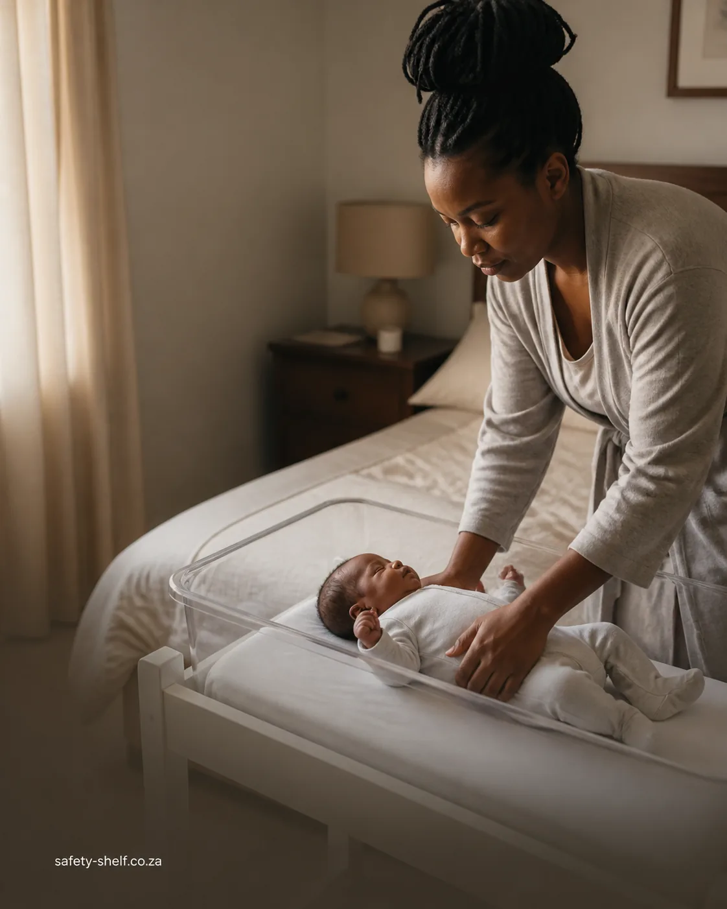
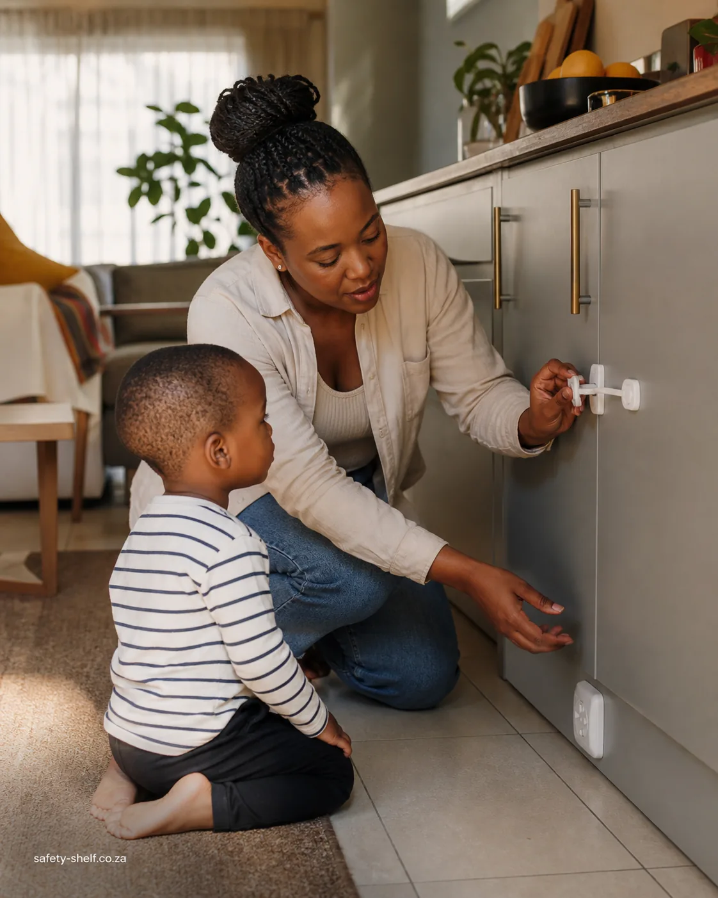
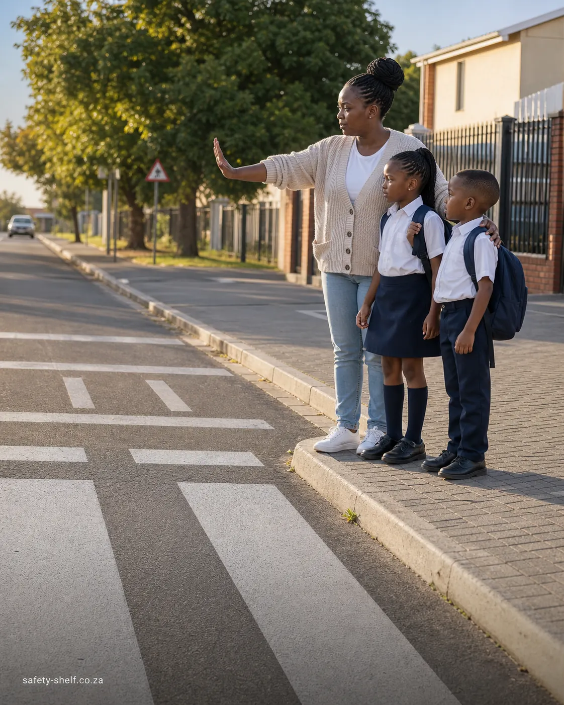
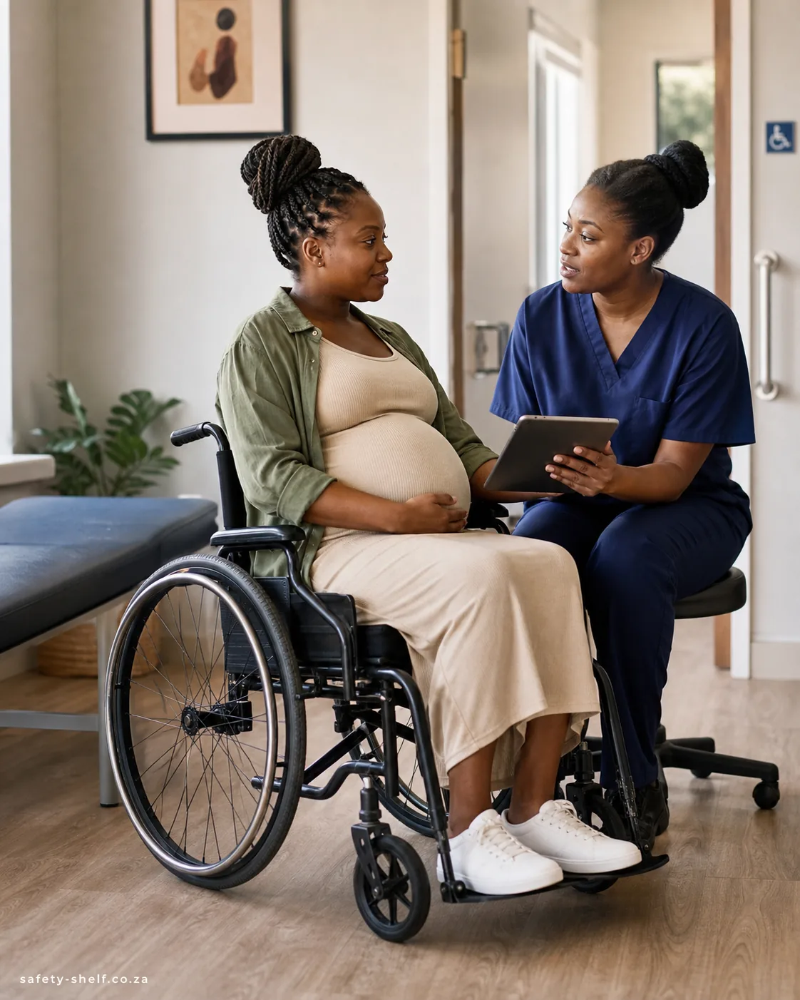
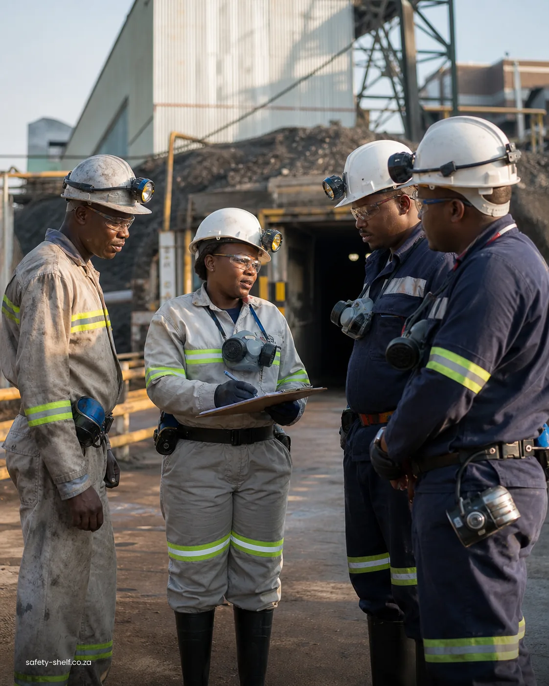

# Production category image review

**Status: approved and attached to all eight production categories on 2026-08-06.**

These eight approved images were generated with the built-in image generation tool from the shared direction and per-category briefs in [`../design/category-image-plan.md`](../design/category-image-plan.md). Each file is a 1122 x 1402 WebP optimized at quality 82 and includes `safety-shelf.co.za` once along the bottom edge.

| Category | Candidate |
| --- | --- |
| Pregnancy Care |  |
| New Born Care |  |
| Child Safety at Home |  |
| Road Safety for Children |  |
| Gender-based Violence |  |
| Emotional & Physical Abuse |  |
| Pregnancy & Disability Awareness |  |
| Mine Health and Safety |  |

Production Convex stores each file and the matching category row holds its storage ID. `categories.list` resolves the public image URL at read time; all eight URLs were verified as HTTP 200 `image/webp` after attachment.
